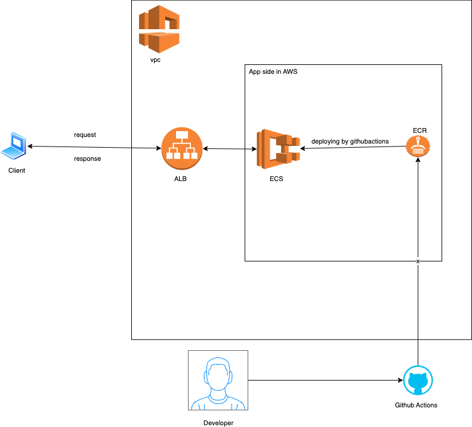

# Create Infrastructure and Deploying a contianer using Pulumi javascript
Configure your AWS credentials and region environment variables to be able to build the infrasrtrucure.

This repo offers a solution of automating the creation of simple infra and deplying tha a simpe nginx app in AWS ECS using Pulumi javascript. The infra includes the following:
- VP, with defined SG.
-  ECS: To deploy the app too.
-  Application Load Balancer
-  ECR: To store the image in private repo.
  
## Overview:
The solution is divided into three folders:
- Stack (Pulumi js) in [infra](./infra), which deploys the basic infrastructure of the solution. It includes VPC, security groups and a Application Loadbalancer.
- Stack (Pulumi js) in [app](./app), which deploys the ecr, builds, and push the image to private repo. Then, it deploys the container from that image into ECS.
- Workflow file (Github actions), to deploy the app to ECS depending on the conditions required.

## Architecture in details:
1. A VPC that has the two security groups. One for the Loadbalancer(ALB), and the other is for AWS ECS (In stack, [infra](./infra)).
2. A LoadBalancer (ALB), which only allow access to an IP that you can set in a variable; for security measurments (In stack, [infra](./infra)).
3. ECR, Where we push our image to [app](./app)
4. ECS, Where the app is deployed to as a container [app](./app).
   

## The Flow
1. The developer do his changes in index.html, as required. 
2. The developer creates the infra and the apps using the two stacks.
3. The developer needs to make changes in the index.html, and pushes it in the repo.
4. Github action (cicd.yaml file), will get triggered, build the new image, push it to ECR and then deploys it in ECS.
5. Any changes to README.md file won't trigger the pipeline, as requested.
6. Clients can access the application using the ALB dns name.

## Using this repo in details:
1. you need to set uo your aws profile in your terminal using Env variables:
   `export AWS_PROFILE=<ypu-aws-profile-name>`
2. change dir to the first stack in dir [infra](./infra). 
   - Build it after changing the stack yaml file to the specific region you want to deploy the app to.
3. change dir to you second stack [app](./app). 
   - Build it after changing the stack yaml file to the specific region you want to deploy the app to.
4. If you changed the index.html file and pushed your changed to your repo, it'd automatically deploy it to your AWS ECS created in step 2.

## Notes:
- I didnt open the app to public, for security reasons. The user should assing the const `myip` in [index.js](./infra/index.js).
  

## Improvements:
- We can create a dns record with proper naming and domain names usig route53, instead of using the dns of ALB.
- If tha application will be accessible for certain users (Office), we can apply WAF on ALB, or even create API GW with cognito for authentication and authoriztion infront of ALB.

## Alternative Architectures:
1. Using Ec2, manged by Devops team, instead of fargate serverless. This will give us more control. I didn't go for this approach, as it'd make the solution more comlex.
2. Instead of ECS, We can Auto Scaling group with Ec2, that has docker installed on it, and has role with permissions to pull images from ECR. Infornt of them, we have the same ALB.
3. Instead of ECS, we can use EKS. I didn't choose this option, as the app is simple and it isn't going to use the capabilities EKS offers; so it'd be overengineering.
   

